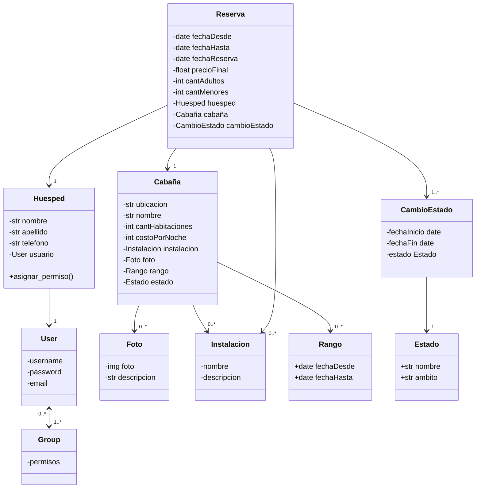

  

``` mermaid
classDiagram

    class User{
        -username
        -password
        -email
    }

    User "0..*" <--> "1..*" Group

    class Group{
        -permisos
    }

    Huesped --> "1" User

    class Huesped{
        -str nombre
        -str apellido
        -str telefono
        -User usuario
        +asignar_permiso()
    }

    Reserva --> "1" Cabaña
    Reserva --> "1" Huesped
    Reserva --> "1..*" CambioEstado 
    Cabaña --> "0..*" Foto
    Cabaña --> "0..*" Instalacion
    Reserva --> "0..*" Instalacion
    Cabaña --> "0..*" Rango
    CambioEstado --> "1" Estado

    class Reserva{
        -date fechaDesde
        -date fechaHasta
        -date fechaReserva
        -float precioFinal
        -int cantAdultos
        -int cantMenores
        -Huesped huesped
        -Cabaña cabaña
        -CambioEstado cambioEstado
    }

    class Cabaña{
        -str ubicacion
        -str nombre
        -int cantHabitaciones
        -int costoPorNoche
        -Instalacion instalacion
        -Foto foto
        -Rango rango
        -Estado estado
    }

    class CambioEstado{
        -fechaInicio date
        -fechaFin date
        -estado Estado
    }

    class Estado{
        +str nombre
        +str ambito
    }

    class Foto{
        -img foto
        -str descripcion
    }

    class Instalacion{
        -nombre
        -descripcion
    }

    class Rango {
        +date fechaDesde
        +date fechaHasta
    }

```