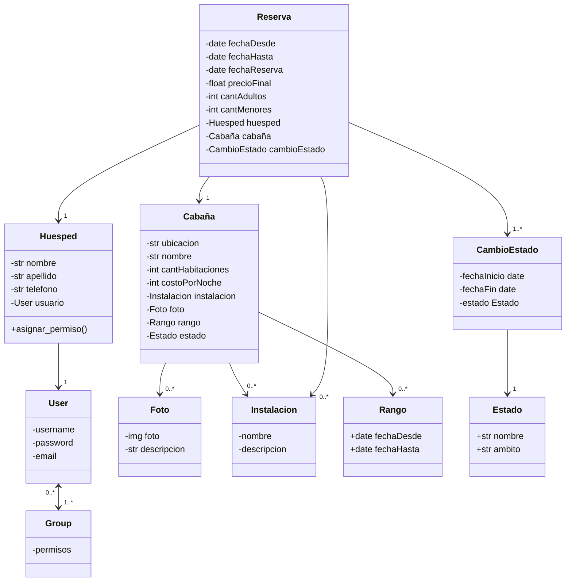

  

## Proyecto: 
- Reserva de cabañas

## Materia: 
- Habilitación profesional

## Docentes:
- Ing. Valeria Abdala

## Equipo "UNISOFT":
-   Alvarez Joaquin                          alvarezdjoaquin@gmail.com 
-	Andres Samuel                            samuel5848@gmail.com 
-	Pairetti Franca                            franpairetti@gmail.com 
-	Zoy Eder Nahuel                         ederzoy6@gmail.com

## Producto: 
- Software para la gestión de reservas de cabañas.

## Nombre del producto
- RentCab

## Notion
- <a href="https://www.notion.so/26194ecc630d42e9b03eca7938eae158?v=0aea7ccf0db449918457444431d7a86c"> notion.so/rentcab </a>

